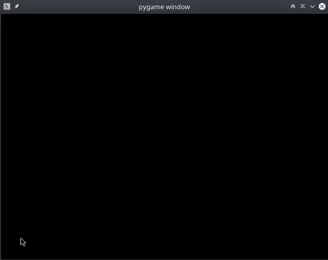
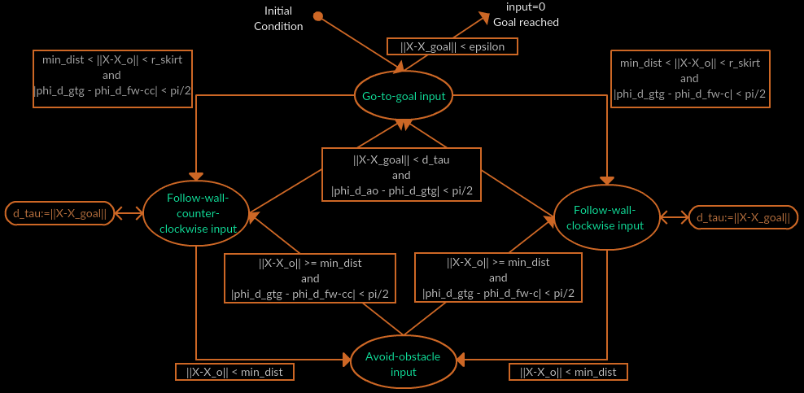

# Unicycle-Navigation

This is an implementation of basic navigation behaviours for a unicycle robot written in Python. The movement of a unicycle robot is controlled by controlling its speed and angular velocity. The robot starts facing horizontally. The global position of the goal is known and it senses (randomly spawned) obstacles within its sensor skirt. It has to reach the goal while avoiding collisions with any obstacles.

The project is based on the theory from the MOOC 'Control of Mobile Robots' by Georgia Tech.

Dependencies: `python3`, `pygame`, `numpy`

(Note: The obstacles' locations and sizes are fundamentally unknown to the robot. It can only detect obstacles when they are in its sensor skirt. The behaviours are changed whenever obstacles are detected within its sensor skirt. Since this is a simulation and actual sensor values are not available, the size and location of the obstacles are used in the program to simulate the sensors' distance data and trigger when the sensor sense obstacles. This might seem to indicate that the robot knows the obstacles a priori, but it is just a consequence of this being a simulation and it can be confirmed that no obstacle position or size data is passed to any controller except for what the sensors can sense.)

A few trials are shown below:



## Introduction

A unicycle robot is a simple two wheeled ground based robot whose motion is controlled by controlling its speed and angular velocity. Motion planning for the differential drive robot (which encompasses a large class of ground-based robots) is usually done by planning for a unicycle robot first and then the controls for speed and angular velocity are mapped to the left and right wheel velocities by simple conversions:

```
v_r = (2*v + omega*L) / 2*R
v_l = (2*v - omega*L) / 2*R
```

where v_r and v_l are the angular velocities of the left and right wheels, v is the speed of the unicycle, omega is the angular velocity of the unicycle and R is the radius of the wheels.

The robot tracks its own position and orientation from the number of ticks of the wheel encoders:

```
x_new = x + D_c*cos(phi)
y_new = y + D_c*sin(phi)
phi_new = phi + (D_r - D_l)/L

where
D_c = (D_r + D_l)/2
D_r = 2*pi*R*ticks_r/N, D_l = 2*pi*R*ticks/N
```

where D_r and D_l are the distances travelled by the right and the left wheels respectively, D_c is the distance travelled by the center of the robot, N is the number of ticks in the encoder per revolution, R is the radius of the wheels, L is the length of the robot and (x, y, phi) is the initial position and orientation of the robot.

In general, the information from encoders is not very reliable on its own since the wheels can slip. In this simulation, it is assumed that the robot can accurately track its own position as slipping has been ignored.

## Current implementation

- Information with the robot:
  - Its own position and orientation - assumed that encoders provide accurate current state
  - Its own geometry - length and breadth of the robot
  - Goal position - fixed goal position known
  - Obstacles within sensor skirt - while the global positions of no obstacles are provided to the robot and obstacles spawn at random locations, it is assumed that on-board sensors can detect obstacles in a fixed radius around the robot
- behaviours:
  - Go to goal
    - Velocity is given by `v = e * v_max * (1 - exp(-alpha*||e||^2))/||e||` where `e = goal_pos - self_pos`, i.e., velocity is very close to v_max when the robot is far away from the goal, and decreases as it approaches the goal
    - Angular velocity is obtained by using a Proportional controller (only the P part in a PID controller) on (desired_heading - current_heading), where the desired_heading is simply towards the obstacle
  - Obstacle avoidance
    - Everything same as go-to-goal (with the goal replaced by the nearest obstacle detected), except that the desired_heading is directly away from the obstacle, i.e., it is a paranoid robot
- behaviour switching:
  - The default behaviour is go-to-goal
  - Whenever one or more obstacles are detected within the sensor skirt, the go-to-goal behaviour is switched for the obstacle avoidance behaviour (considering the closest obstacle) till the obstacle(s) is (\are) safely out of the sensor skirt. Then the go-to-goal behaviour is continued

The navigation framework is general, in the sense that the goal position can be dynamic and the robot will still navigate around obstacles to reach it (this is the first demonstration to be done next). This can be used in complex navigation scenarios (like solving mazes) where reaching to the final goal can be solved with the help of a layered architecture where a higher level planning algorithm like A* or Dijkstra's on a map gives a set of intermediate goal points to this medium level controller sequentially till the robot reaches the final goal. (As mentioned earlier, the control output of this layer (v, omega) is given to the lowest layer which finally causes the wheels of the differential robot to turn)

## Roadmap ahead

- Demonstration of navigation to a moving goal
- Implementation of a **follow-wall** behaviour (induced sliding mode controller) so that the robot can navigate around non-convex obstacles
- Implementation of a **hybrid automata** to switch between the three behaviours



- Improving the avoid obstacle behaviour - instead of a paranoid robot, could weigh and add "obstacle vectors" depending on each obstacle's distance and the robot's direction of travel
- Obstacles placement sanity checks - so that obstacles are not placed on top of the goal or the initial position of the robot or they do not enclose the goal entirely
